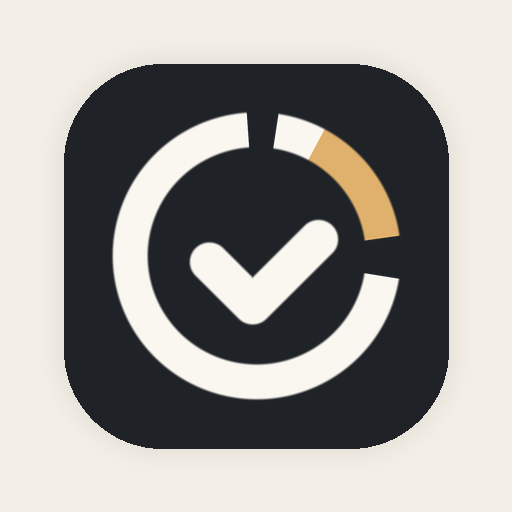
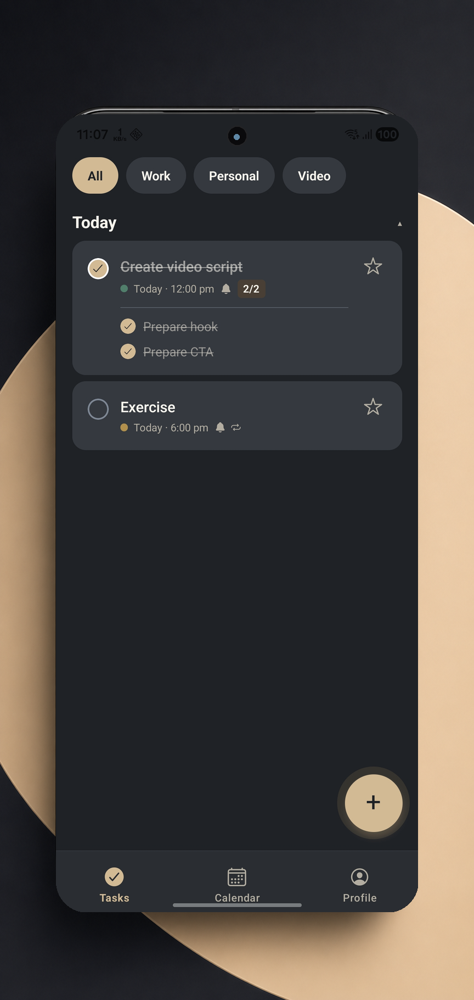
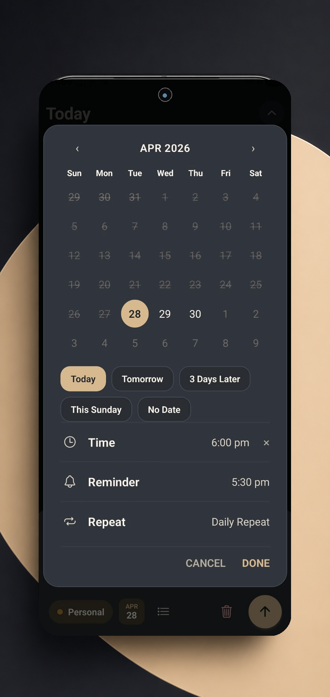
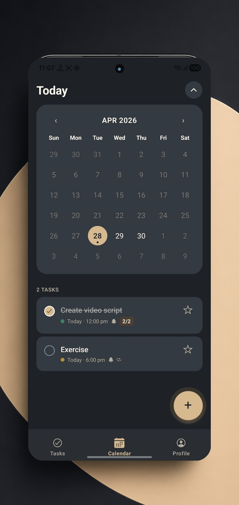

<div align="center">



# Streak Todo

**A focused, local-first task planner for Android.**
Capture tasks, set reminders that fire on time, and keep an honest streak — no paywalls, no ads, no forced sign-up.

[Privacy policy](https://streaktodo.coderixx.com/privacy) ·
[Delete your data](https://streaktodo.coderixx.com/delete-account) ·
Made by **[Coderixx](https://coderixx.com)**

</div>

---

## Overview

Streak Todo is the productivity app I'd want on my own phone: fast capture, real recurrence, reminders that don't drift, and a streak counter that doesn't lie to you on a missed day. It's built local-first — your data lives on your device, not on someone else's server — with optional Google sign-in for users who want their account associated with usage analytics.

Currently in **closed testing on Google Play**, with v1.0 production submission queued behind the standard 14-day testing requirement for new developer accounts.

## Highlights

<table>
<tr>
<td width="33%" valign="top">



**Tasks home** with category pills, sectioned by Today / Upcoming / Previous, overdue stripe + badge, and a single-tap completion checkbox.

</td>
<td width="33%" valign="top">



**Schedule sheet** combines date, time, reminder, and repeat-rule choice in one surface. Custom recurrence supports "every 2 weeks on Mon/Wed, until June" type rules.

</td>
<td width="33%" valign="top">



**Calendar tab** with month grid, week-strip collapse, marker dots for days that have tasks, and a selected-day list that reuses the same task row component.

</td>
</tr>
</table>

## What's inside

- Quick task capture from a floating action button anywhere in the app
- Subtasks, notes, and color-tagged categories per task
- Due dates, times, lead-time reminders, and a real custom-recurrence editor
- Local reminders that survive a reboot, with `SCHEDULE_EXACT_ALARM` for on-time delivery
- "Done" and "Snooze 10m" actions inside the notification itself
- Calendar view with month / week modes
- Profile dashboard: streak counter, weekly completion bars, next-7-days strip, category breakdown donut, overview totals
- Light / dark / system themes (persisted)
- Backup export and import via the system file picker
- Continue-without-signing-in path so Play reviewers and privacy-conscious users can use every screen of the app without a Google account

## Tech stack

| | |
|---|---|
| **Runtime** | React Native 0.81 + Expo SDK 54, TypeScript strict |
| **Routing** | expo-router (file-system, typed routes) |
| **Persistence** | expo-sqlite, raw SQL repositories, no ORM |
| **Auth** | `@react-native-google-signin/google-signin` (Web Client ID, OAuth ID tokens) |
| **Notifications** | expo-notifications with `DATE` triggers + Android `SCHEDULE_EXACT_ALARM` |
| **Analytics** | Mixpanel (EU residency), bounded task-content payloads, opt-out via env |
| **State** | React hooks + a small in-memory pub/sub event bus for cross-screen invalidation |
| **Theme** | Two-layer token system (raw palette → semantic tokens), WCAG-AA audited |
| **Build** | EAS Build, signed via Play App Signing, AAB output |

## Project layout

```
streaktodo/
├── app/                    expo-router screens (Tasks / Calendar / Profile / onboarding / sign-in / categories / notifications)
├── src/
│   ├── components/         TaskRow, TaskComposer, CalendarGrid, charts, sheets, dialogs
│   ├── db/                 repos/, hooks, schema, migrations, event bus
│   ├── lib/                analytics, auth, notificationScheduler, recurrence, streakStats, taskGrouping
│   ├── screens/            SignInScreen
│   └── theme/              tokens, semantic theme, ThemeProvider
├── android/                checked in so dev builds work without an EAS roundtrip
├── assets/                 app icons, splash, store assets
├── docs/
│   └── BUILD_PLAN.md       phase-by-phase engineering log
├── design-system/          visual source of truth for the mobile UI
└── tools/                  scripts (e.g. Play Console Data Safety CSV fixer)
```

## Documentation

- **[`docs/BUILD_PLAN.md`](./docs/BUILD_PLAN.md)** — phase-by-phase engineering log, deferred items, and the reasoning behind every "we deliberately did not do this"
- **[`PRIVACY_POLICY.md`](./PRIVACY_POLICY.md)** — what the app collects, sends, and shares; mirrored at [streaktodo.coderixx.com/privacy](https://streaktodo.coderixx.com/privacy)
- **[`PLAY_DATA_SAFETY.md`](./PLAY_DATA_SAFETY.md)** — Play Console Data Safety form draft + a CSV-import workaround for a misleading Console UI
- **[`PLAY_LISTING.md`](./PLAY_LISTING.md)** — paste-ready Play Store listing copy
- **[`RELEASE_CHECKLIST.md`](./RELEASE_CHECKLIST.md)** — what we walk through before each public release
- **[`STORE_COPY.md`](./STORE_COPY.md)** — long-form Play Store description draft
- **[`src/db/migrations/MIGRATIONS.md`](./src/db/migrations/MIGRATIONS.md)** — SQLite migration policy + the column-rebuild dance
- **[`src/theme/CONTRAST_AUDIT.md`](./src/theme/CONTRAST_AUDIT.md)** — WCAG-AA color contrast audit with before/after ratios

## Local development

```bash
# Prereqs: Node 20+, Java 17, Android SDK with API 35, a connected device.
npm install --legacy-peer-deps
cp .env.example .env                # then add EXPO_PUBLIC_GOOGLE_WEB_CLIENT_ID
npx expo run:android                # native Android build + install
```

The `android/` folder is checked into the repo so dev builds don't need a fresh `expo prebuild` round-trip. To regenerate it from `app.config.ts`:

```bash
npx expo prebuild --clean
```

## Production build

Production AABs are built via EAS. The upload keystore lives in the project's Expo account; Play Console signs each release with the production app-signing key.

```bash
npx eas-cli@latest build -p android --profile production
```

`eas.json` carries the production environment variables (Google client ID, Mixpanel region). The Mixpanel project token is in [`branding.js`](./branding.js) and is public-by-design — Mixpanel project tokens identify the destination project, not write credentials.

## Status

| | |
|---|---|
| **Version** | 1.0.0 (closed testing) |
| **Platform** | Android 7.0+ (API 24+), targets API 35 |
| **Distribution** | Google Play closed testing track; production submission pending the 14-day tester requirement |
| **Roadmap** | See [`docs/BUILD_PLAN.md`](./docs/BUILD_PLAN.md) phases 13–16 (collaboration, sync, achievement badges, home-screen widgets) |

## Credits

Designed and built by **[Coderixx](https://coderixx.com)**.

For questions, feedback, or to report an issue: [ankitpathakofficial@gmail.com](mailto:ankitpathakofficial@gmail.com)
